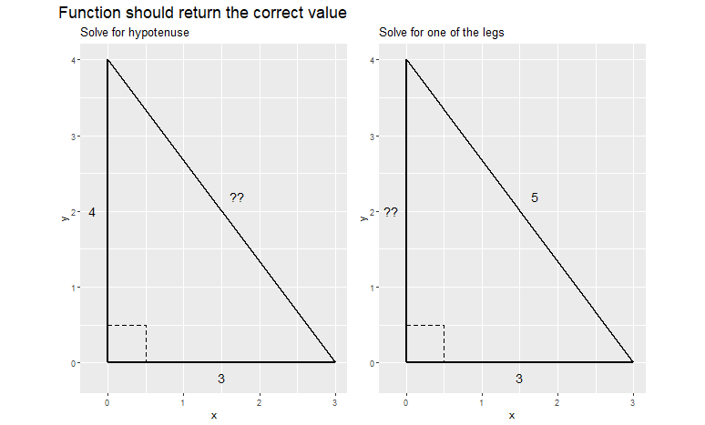
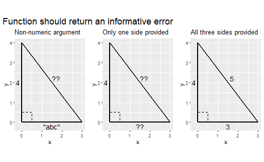

# Overview

**Due by 11:59 pm on ~~Friday, October 28th~~ Saturday, October 29th.**

The goal of this assignment is to practice basic R programming skills (control structures and functions).


# Accessing the `hw04` repository

* Go [at this link](https://classroom.github.com/a/U-kxzdwT) to accept and create your private `hw4` repository on GitHub. Once you do so, your repository will be built in a few seconds. It follows the naming convention `hw4-<USERNAME>`  
* Once the your repository has been created, click on the link you see, which will take you to your repository. 
* Finally, clone the repository to your computer (or R workbench) following the process below.


# Cloning your `hw04` repository

After you have accessed the `hw04` repository (see above), follow the [same steps you completed for `hw01`](/homework/edit-readme/) to clone the repository.


# General workflow

Your general workflow will be:

* Accept the repo and clone it (see above)
* Make changes locally to the files in RStudio
* Save your changes
* Stage-Commit-Push: stage and commit your changes to your local Git repo; then push them online to GitHub. You can complete these steps using the Git GUI integrated into RStudio. In general, you do not want to directly modify your online GitHub repo (if you do so, remember to pull first); instead modify your local Git repo, then stage-commit-push your changes up to your online GitHub repo. 


# Programming exercises


#### Question 1. 
Compute the number of unique values in each column of the `iris` dataset. Write code that solves this task using: a `for` loop, `map()`, and `across()`.


#### Question 2. 
Calculate the square of each element in the given vector `v` using a `for` loop and `map()`.


```
##  [1] 20 19 18 17 16 15 14 13 12 11 10  9  8  7  6  5  4  3  2  1
```


#### Question 3. 
Calculate the square of all elements in the given matrix `m` using `for` loops and `apply()`. Check the documentation for `apply()`.


```
##      [,1] [,2] [,3] [,4]
## [1,]    1    2    3    4
## [2,]    5    6    7    8
## [3,]    9   10   11   12
## [4,]   13   14   15   16
```


#### Question 4.
Write a function that takes two numbers and calculates the sum of the squared value of them. Call the function with a couple of examples.


#### Question 5.
Write code to calculate the length of sides in a right-triangle using the [Pythagorean Theorem](https://en.wikipedia.org/wiki/Pythagorean_theorem):  
$$a^2 + b^2 = c^2$$
Your tasks:

- set up your triangle sides, call them a, b, c, and give them values 3, 4, NULL
- check how many sides you have provided values for, and for each evaluation print a message; if you provided the lengths of only one side or all three sides, the printed message should warn you to provide value for two sides only
- perform the calculations applying the Pythagorean Theorem


#### Question 6.
Rewrite your code from the previous question as a function (e.g., write a function to calculate the length of sides in a right-triangle using the Pythagorean Theorem) and add some additional checks. Call the function with some examples.

Your tasks:

- set up your triangle sides as function parameters
- the function should be flexible: the function works if the user gives it values for two sides, but they can be either `a` and `b`, or `b` and `c`, or `a` and `c`
- if the user only provides the length of one side, the function should throw an error with stop(), [see here](http://r4ds.had.co.nz/functions.html)
- if the user provides the lengths of all three sides, the function should throw an error with stop()
- if the user provides any values other than numeric values, the function should throw an error with stop()
- perform the calculations applying the Pythagorean Theorem
- call the function with a few examples, include also examples in which the function should throw an error
    
Your function should be able to correctly handle the examples below:




<!--        
    

    
    ```
    ## Warning in grid.Call(C_stringMetric, as.graphicsAnnot(x$label)): font family not
    ## found in Windows font database
    ```
    
    ```
    ## Warning in grid.Call(C_textBounds, as.graphicsAnnot(x$label), x$x, x$y, : font
    ## family not found in Windows font database
    ```
    
    }}index_files/figure-html/unnamed-chunk-5-1.png" alt="Correct use cases of the function." width="672" />

    
    ```
    ## Warning in grid.Call(C_textBounds, as.graphicsAnnot(x$label), x$x, x$y, : font
    ## family not found in Windows font database
    
    ## Warning in grid.Call(C_textBounds, as.graphicsAnnot(x$label), x$x, x$y, : font
    ## family not found in Windows font database
    ```
    
    }}index_files/figure-html/unnamed-chunk-6-1.png" alt="Incorrect use cases of the function." width="672" />
-->

# Submit the assignment

To submit the assignment, simply push to your repository the last version of your assignment before the deadline. 

Then copy your repository URL (e.g., `https://github.com/css-fall22/hw4-brinasab`) and submit it to Canvas under HW04 before the deadline.

Make sure to stage-commit-push:

- `programming_exercises.Rmd` (the main file you will add your code to)
- `programming_exercises.md` (you will generate this file from the .Rmd by simply knitting it)


# Rubric

Needs improvement: Doesn't complete all components. Code contain errors and/or is not clearly written and/or not documented. Uses the same type of plot for each graph, or doesn't use plots appropriate for the variables being analyzed. No record of commits other than the final push to GitHub.

Satisfactory: Solid effort. Hits all the elements. Finished all components of the assignment with only minor deficiencies. Easy to follow (both the code and the output). 

Excellent: Finished all components of the assignment correctly and used efficient code to complete the exercises. Code is well-documented (both self-documented and with additional comments as necessary). Functions are written succinctly and comprehensibly. Use multiple commits to back up and show a progression in the work. 

For further details, see the [general rubric](/faq/homework-evaluations/) we adopt for grading.


# Acknowledgments

* This page has been developed starting from Benjamin Soltoff’s “Computing for the Social Sciences” course materials, licensed under the CC BY-NC 4.0 Creative Commons License.
